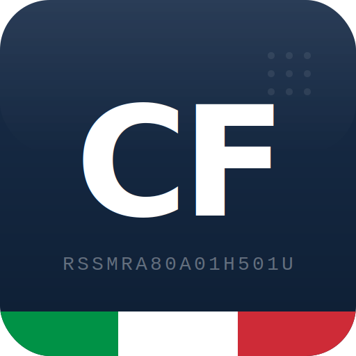

<p align="center">
  
</p>

# Codice Fiscale

**FULL DOCUMENTATION**: [https://dennisturco.github.io/CodiceFiscale/](https://dennisturco.github.io/CodiceFiscale/)

A lightweight .NET library for Italian fiscal compliance: validate, parse and generate **Codice Fiscale**, validate **Partita IVA** and **IBAN**, and query a built-in database of Italian municipalities and foreign countries (Belfiore codes). Everything runs locally — no HTTP calls, no external services, no data leaves your app.

All validation logic runs **locally**. No HTTP calls, no data ever leaves your application.

[](https://www.nuget.org/packages/CodiceFiscale)
[](https://opensource.org/licenses/MIT)

## Installation

```bash
 dotnet add package CodiceFiscale
```

## Features

- Fiscal code validation (format + checksum)
- Fiscal code generation from personal data
- Cross-check: does this fiscal code match these personal details?
- Italian VAT number validation (standard, public entity, foreign)
- IBAN validation (mod97, all countries)
- Comuni and codici Belfiore embedded dataset (no external files needed)
- Fully tested

## Usage

1. Validate a fiscal code

    ```cs
    using CodiceFiscale;

    bool isValid = CodiceFiscaleValidator.IsValid("RSSMRA80A01H501U"); // true
    ```

2. Generate a fiscal code

    ```cs
    string cf = CodiceFiscaleGenerator.Generate(
        name:        "Mario",
        surname:     "Rossi",
        dateOfBirth: new DateOnly(1980, 1, 1),
        gender:      Gender.Male,
        belfioreCode: "H501"   // Roma — use MunicipalityExtensions to look up the code
    ); // "RSSMRA80A01H501U"
    ```

3. Cross-check fiscal code against personal data

    ```cs
    bool matches = CodiceFiscaleMatcher.Matches(
        cf:           "RSSMRA80A01H501U",
        name:         "Mario",
        surname:      "Rossi",
        dateOfBirth:  new DateOnly(1980, 1, 1),
        gender:       Gender.Male,
        belfioreCode: "H501"
    ); // true
    ```

4. Parse a fiscal code

    ```cs
    CodiceFiscaleData parsed = CodiceFiscaleParser.Parse("RSSMRA80A01H501U");

    parsed.Gender       // Male
    parsed.DateOfBirth  // 1980-01-01
    parsed.BelfioreCode // "H501"
    ```

5. Age helpers (extension methods on `CodiceFiscaleData`)

    ```cs
    int age     = parsed.GetAge();    // e.g. 45
    bool adult  = parsed.IsAdult();   // true if age >= 18
    ```

6. Look up a municipality

    ```cs
    Municipality? comune = "H501".GetMunicipalityByBelfiore(); // Roma
    Municipality? byName = "Milano".GetMunicipalityByName();
    Municipality? byCAP  = "00186".GetMunicipalityByCAP();

    IEnumerable<Municipality>? inRoma = "Roma".GetAllByProvince(); // 121 comuni
    IEnumerable<Municipality>  all    = MunicipalityExtensions.GetAll(); // ~7 896
    ```

7. Validate an Italian VAT number

    ```cs
    bool isValid = ItalianVatCodeValidator.IsValid("00484960588", isConsumer: false, isFiscal: false); // true
    ```

8. Validate an IBAN

    ```cs
    bool isValid = IBANValidator.IsValid("IT60X0542811101000000123456"); // true
    ```

## Edge cases handled

- Names with fewer than 3 consonants (Re, Li, Yu)
- Names with apostrophes and accents (D'Amico, Rosà)
- Foreign-born individuals (Belfiore code Z + country number)
- Omocodia (alternate fiscal codes with letters replacing digits)
- VAT numbers for public entities (starting with 8 or 9)
- Obsolete municipalities (comuni soppressi)

## Why not an API?

Fiscal codes and VAT numbers are personal data. Sending them to a third-party
server to validate them raises immediate GDPR concerns. This library validates
everything locally. The data never leaves your application.

## Dataset

The comuni/Belfiore dataset is sourced from
ISTAT open data and embedded directly
in the library binary. No external files are required at runtime.

The dataset is updated with each minor release to reflect municipality changes
(merges, renames, new comuni).

## Contributing

Contributions are welcome. If you find a fiscal code that validates incorrectly,
please open an issue with:

1. The fiscal code (you can anonymise it — just keep the structure)
2. The personal data it should/should not match
3. The expected result

## License

[](https://opensource.org/licenses/MIT)

## Municipalities data

[https://comuni-ita.readme.io/reference/getcomuni](https://comuni-ita.readme.io/reference/getcomuni)

## Build locally

```powershell
dotnet build
dotnet test
```

## Launch DocFX locally

```powershell
docfx .\docfx.json --serve
```
